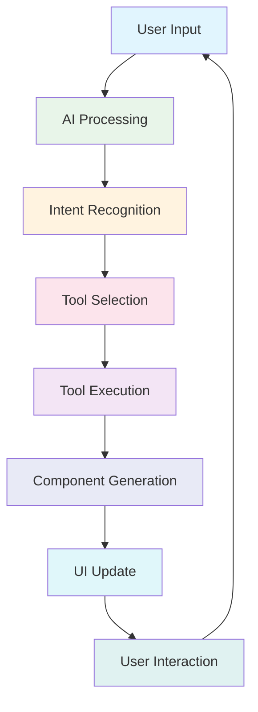

# Promptmack

<div align="center">
  <h2>An adaptive AI agent that performs tasks and actions online for users</h2>
</div>

<p align="center">
  
</p>

<p align="center">
  <a href="#features"><strong>Features</strong></a> ·
  <a href="#tools"><strong>Tools</strong></a> ·
  <a href="#getting-started"><strong>Getting Started</strong></a> ·
  <a href="#documentation"><strong>Documentation</strong></a> ·
  <a href="#contributing"><strong>Contributing</strong></a>
</p>

## Introduction

Promptmack is an adaptive AI agent platform designed to transform how humans interact with artificial intelligence. It orchestrates a powerful ecosystem of AI tools to perform tasks online for users through a natural language interface.

Unlike traditional chat interfaces, Promptmack provides:

- **Dynamic streaming UI** that materializes components in real-time
- **Specialized tools** for news search, academic research, video discovery, and web interactions
- **Multimodal input** supporting text, files, and structured data
- **Adaptive responses** tailored to user needs

## Features

- **Streaming Intelligence**
  - Real-time streaming responses via Vercel AI SDK
  - Dynamic UI component generation
  - Progressive rendering of information

- **Tool Orchestration**
  - Parametric tool execution based on user intent
  - Integration with multiple external APIs
  - Structured results for improved readability

- **Advanced UI**
  - Component-based visual feedback
  - Light and dark mode support
  - Responsive design for all devices
  - File attachment support

- **Technical Foundation**
  - Next.js 14 App Router
  - Google Gemini AI model integration
  - PostgreSQL database (via Vercel Postgres)
  - NextAuth.js authentication

## Tools

Promptmack includes several powerful tools out of the box:

| Tool | Description | Example Usage |
|------|-------------|---------------|
| News Search | Find current news articles | "Show me news about AI advancements" |
| Scholar Search | Find academic papers and research | "Find scholarly articles about climate change" |
| Similar Website | Find websites similar to a URL | "Find sites similar to twitter.com" |
| Videos | Search for videos across the web | "Find tutorial videos for React" |
| Form Submission | Automate web form submissions | "Fill out a contact form on example.com" |
| Weather | Get current weather conditions | "What's the weather in New York?" |

See the [Tools Documentation](docs/tools.md) for a complete list of available tools and their capabilities.

## Getting Started

### Prerequisites

- Node.js 18+
- pnpm 9+
- API keys for external services (Serper, Exa, Skyvern, etc.)

### Installation

1. Clone the repository:
   ```bash
   git clone https://github.com/your-organization/promptmack.git
   cd promptmack
   ```

2. Install dependencies:
```bash
pnpm install
   ```

3. Create a `.env` file based on `.env.example`:
   ```bash
   cp .env.example .env
   ```

4. Update `.env` with your API keys and configuration.

5. Start the development server:
   ```bash
pnpm dev
```

6. Access the application at [http://localhost:3000](http://localhost:3000)

## Architecture

Promptmack follows a streaming-first architecture designed for real-time interactions:



See the [Technical Introduction](docs/technical_introduction.md) for a detailed architectural overview.

## Documentation

- [Project Overview](docs/promptmack_overview.md) - Comprehensive overview of Promptmack
- [Technical Introduction](docs/technical_introduction.md) - Technical architecture and concepts
- [Development Workflow](docs/development_workflow.md) - Guide for development workflow
- [Tools Documentation](docs/tools.md) - Available tools and their usage
- [Project Roadmap](docs/project_roadmap.md) - Future development plans
- [Skyvern Integration Guide](docs/skyvern_integration_guide.md) - Form automation details

## Adding New Tools

Promptmack is designed to be easily extended with new tools. The basic process involves:

1. Define the tool in `app/(chat)/api/chat/route.ts`
2. Create a UI component for the tool results
3. Add the component to the message renderer
4. Update the system prompt to inform the AI about the new tool

See the [Development Workflow](docs/development_workflow.md) for detailed instructions on adding new tools.

## Best Practices

When developing for Promptmack, follow these best practices:

1. **Error Handling**: Implement robust error handling in tools and components
2. **Loading States**: Provide meaningful loading states for all components
3. **Responsive Design**: Ensure components work well on all screen sizes
4. **Security**: Keep API keys server-side and validate all inputs
5. **Performance**: Optimize API calls and component rendering

## Contributing

We welcome contributions to Promptmack! Please follow these steps:

1. Fork the repository
2. Create a feature branch (`git checkout -b feature/amazing-feature`)
3. Commit your changes (`git commit -m 'Add some amazing feature'`)
4. Push to the branch (`git push origin feature/amazing-feature`)
5. Open a Pull Request

See [CONTRIBUTING.md](CONTRIBUTING.md) for more details.

## License

This project is licensed under the terms specified in [LICENSE](LICENSE).

## Roadmap

See our [Project Roadmap](docs/project_roadmap.md) for planned features and enhancements.

## Acknowledgements

- [Vercel](https://vercel.com/) for the Next.js framework and AI SDK
- [Google](https://deepmind.google/technologies/gemini/) for the Gemini AI model
- [shadcn/ui](https://ui.shadcn.com/) for UI components
- All contributors who have helped shape this project
