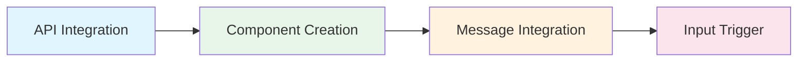

# Promptmack Developer Guide 🚀

## Quick Start 🎯



## Integration Patterns 🔄

### 1. API Integration Pattern

**Location:** `app/(chat)/api/chat/route.ts`

```typescript
// 1. Add Tool Definition
const tools = {
  yourTool: {
    name: "yourTool",
    description: "What your tool does",
    execute: async (params) => {
      const response = await fetch("API_ENDPOINT", {
        headers: { Authorization: process.env.API_KEY }
      });
      return response.json();
    }
  }
}

// 2. Update System Prompt
const systemPrompt = `${basePrompt}
You can now [description of new capability]`;
```

### 2. Component Creation Pattern

**Location:** `components/custom/[feature].tsx`

```typescript
export const Feature = ({ featureData }: FeatureProps) => {
  // 1. Loading State
  if (!featureData) return <LoadingState />;

  // 2. Error State
  if ('error' in featureData) return <ErrorState error={featureData.error} />;

  // 3. Success State
  return (
    <div className="rounded-lg border p-4">
      {/* Your UI Components */}
    </div>
  );
};
```

### 3. Message Integration Pattern

**Location:** `components/custom/message.tsx`

```typescript
// 1. Import Component
import { Feature } from '../feature/feature';

// 2. Add to Tool Chain
{toolName === "yourTool" ? (
  <Feature featureData={result} />
) : null}
```

### 4. Input Trigger Pattern

**Location:** `components/custom/multimodal-input.tsx`

```typescript
const actions = [
  {
    title: "Your Feature",
    label: "Action Description",
    action: "Trigger phrase for AI"
  }
];
```

## Environment Setup 🔧

**Location:** `.env.example`
```env
YOUR_API_KEY=your_api_key_here
```

## Database Integration (Optional) 💾

If your feature requires database operations:

1. **Schema Definition** (`db/schema.ts`)
```typescript
export const yourTable = pgTable("your_table", {
  id: serial("id").primaryKey(),
  // Add fields
});
```

2. **Query Definition** (`db/queries.ts`)
```typescript
export const queries = {
  createYourRecord: async (data) => {
    return db.insert(yourTable).values(data);
  }
};
```

3. **Migration** (`db/migrate.ts`)
```typescript
await db.execute(sql`
  CREATE TABLE IF NOT EXISTS your_table (
    id SERIAL PRIMARY KEY
    -- Add fields
  );
`);
```

## Best Practices 🎯

1. **Error Handling**
   - Let errors cascade up to the top level
   - Provide meaningful error messages
   - Always handle loading and error states

2. **State Management**
   - Prefer stateless over stateful components
   - Use chat history as primary storage
   - Maintain loading state parity

3. **UI/UX**
   - Follow existing component patterns
   - Ensure responsive design
   - Provide meaningful loading states

4. **Security**
   - Never expose API keys in client code
   - Validate all inputs
   - Use proper authentication

## Testing Your Integration 🧪

1. Start development server:
```bash
pnpm dev
```

2. Test your feature with these prompts:
```
- "Use [your feature] to [action]"
- "Show me [feature result]"
- "Help me with [feature task]"
```

## Troubleshooting 🔍

1. **Component not rendering?**
   - Check tool name matches in route.ts and message.tsx
   - Verify loading state implementation

2. **API not responding?**
   - Verify API key in .env
   - Check network tab for errors
   - Validate API endpoint URL

3. **Database issues?**
   - Run migrations: `pnpm build`
   - Check database connection
   - Verify schema matches

## Need Help? 🤝

- Check existing implementations in `/components`
- Review similar patterns in route.ts
- Examine message.tsx for integration examples

Remember: The system is designed to be modular and extensible. When in doubt, follow existing patterns and maintain consistency with the current implementation.