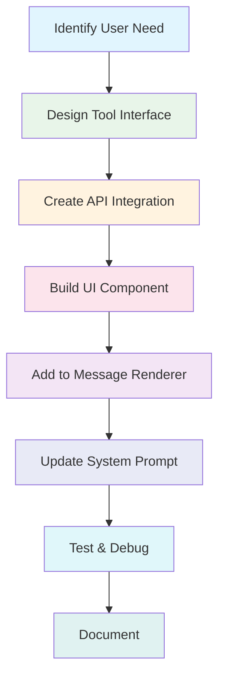

# Promptmack Development Workflow

This guide outlines the step-by-step process for extending Promptmack with new tools and features.

## Getting Started

### Prerequisites

Before you begin, ensure you have:

1. Node.js 18+ installed
2. pnpm installed (`npm install -g pnpm`)
3. Git set up for version control

### Setting Up Your Development Environment

1. Clone the repository:
   ```bash
   git clone https://github.com/your-organization/promptmack.git
   cd promptmack
   ```

2. Install dependencies:
   ```bash
   pnpm install
   ```

3. Create a `.env` file based on `.env.example`:
   ```bash
   cp .env.example .env
   ```

4. Update the `.env` file with your API keys and database credentials

5. Start the development server:
   ```bash
   pnpm dev
   ```

## Development Workflow

Here's the standard workflow for adding new capabilities to Promptmack:



### 1. Identifying User Needs

Before adding a new tool, identify:
- What problem does this solve for users?
- What inputs does the tool need?
- What outputs should it provide?
- How will users interact with the results?

### 2. Designing the Tool Interface

Define your tool's input parameters and output structure:

```typescript
// Input parameters
interface ToolParams {
  query: string;
  filters?: {
    category?: string;
    date?: string;
    location?: string;
  };
}

// Output structure
interface ToolResult {
  title: string;
  items: Array<{
    id: string;
    title: string;
    description: string;
    url: string;
    image?: string;
  }>;
  metadata: {
    count: number;
    filters: Record<string, string>;
  };
}
```

### 3. Creating the API Integration

#### Step 1: Add to `app/(chat)/api/chat/route.ts`

```typescript
// Import any necessary packages
import axios from "axios";
import { z } from "zod";

// Inside the POST handler function:
tools: {
  // ... existing tools
  
  searchProducts: {
    description: "Search for products based on user query and filters",
    parameters: z.object({
      query: z.string().describe("Search query"),
      category: z.string().optional().describe("Product category"),
      maxPrice: z.number().optional().describe("Maximum price"),
      minRating: z.number().optional().describe("Minimum rating (1-5)"),
    }),
    execute: async ({ query, category, maxPrice, minRating }) => {
      try {
        // Log the request for debugging
        console.log(`Searching products: ${query}, filters:`, { category, maxPrice, minRating });
        
        // Make API request
        const response = await axios.get("https://api.example.com/products", {
          params: {
            q: query,
            category,
            max_price: maxPrice,
            min_rating: minRating
          },
          headers: {
            "Authorization": `Bearer ${process.env.PRODUCT_API_KEY}`,
            "Content-Type": "application/json"
          }
        });
        
        // Process and return the data
        return {
          title: `Product search results for "${query}"`,
          items: response.data.products.map(product => ({
            id: product.id,
            title: product.name,
            description: product.description,
            price: product.price,
            rating: product.rating,
            image: product.image_url,
            url: product.product_url
          })),
          metadata: {
            count: response.data.total,
            filters: {
              category: category || "All",
              price: maxPrice ? `Up to $${maxPrice}` : "Any price",
              rating: minRating ? `${minRating}+ stars` : "Any rating"
            }
          }
        };
      } catch (error) {
        console.error("Product search API error:", error);
        
        // Return a structured error that can be handled by the UI
        return {
          error: error.response?.data?.message || "Failed to search products",
          errorCode: error.response?.status || 500
        };
      }
    }
  }
}
```

#### Step 2: Update the System Prompt

In the same file, update the system prompt to inform the AI about the new tool:

```typescript
system: `\n
  - you are Promptmack
  - you are a hyperintelligent helpful assistant
  - you help users and you currently have these tools at your disposal: news, scholar, similar, form-submit, videos, and searchProducts!
  - searchProducts can be used to find products based on user queries and filters (category, price, rating)
  - today's date is ${new Date().toLocaleDateString()}.
  - go with the flow
  - ask for any details you don't know'
`
```

### 4. Building the UI Component

Create a new file in the appropriate directory (e.g., `components/products/product-search.tsx`):

```typescript
"use client";

import { motion } from "framer-motion";
import Image from "next/image";
import React from "react";

interface ProductItem {
  id: string;
  title: string;
  description: string;
  price: number;
  rating: number;
  image?: string;
  url: string;
}

interface ProductSearchData {
  title: string;
  items: ProductItem[];
  metadata: {
    count: number;
    filters: Record<string, string>;
  };
  error?: string;
  errorCode?: number;
}

interface ProductSearchProps {
  productData?: ProductSearchData;
}

export const ProductSearch = ({ productData }: ProductSearchProps) => {
  // Loading state (when tool is executing)
  if (!productData) {
    return (
      <div className="space-y-4">
        <div className="h-6 bg-zinc-200 dark:bg-zinc-800 rounded w-3/4 animate-pulse" />
        <div className="grid grid-cols-1 md:grid-cols-2 gap-4">
          {[...Array(4)].map((_, i) => (
            <div key={i} className="rounded-lg bg-zinc-100 dark:bg-zinc-800/50 p-4 animate-pulse space-y-3">
              <div className="flex gap-3">
                <div className="size-16 bg-zinc-200 dark:bg-zinc-700 rounded" />
                <div className="space-y-2 flex-1">
                  <div className="h-4 bg-zinc-200 dark:bg-zinc-700 rounded w-3/4" />
                  <div className="h-3 bg-zinc-200 dark:bg-zinc-700 rounded w-1/2" />
                </div>
              </div>
              <div className="h-2 bg-zinc-200 dark:bg-zinc-700 rounded w-full" />
              <div className="h-2 bg-zinc-200 dark:bg-zinc-700 rounded w-5/6" />
            </div>
          ))}
        </div>
      </div>
    );
  }

  // Error state
  if (productData.error) {
    return (
      <div className="p-4 rounded-lg bg-red-50 dark:bg-red-900/20 text-red-600 dark:text-red-400">
        <h3 className="font-medium">Error searching products</h3>
        <p className="text-sm mt-1">{productData.error}</p>
        <p className="text-xs mt-2 text-red-500 dark:text-red-300">
          Error code: {productData.errorCode || "Unknown"}
        </p>
      </div>
    );
  }

  // Empty results
  if (productData.items.length === 0) {
    return (
      <div className="p-4 rounded-lg bg-zinc-100 dark:bg-zinc-800/50">
        <h3 className="font-medium">No products found</h3>
        <p className="text-sm mt-1 text-zinc-600 dark:text-zinc-400">
          Try adjusting your search terms or filters
        </p>
      </div>
    );
  }

  // Success state with results
  return (
    <div className="space-y-4">
      <div className="flex justify-between items-center">
        <h3 className="font-medium text-lg">{productData.title}</h3>
        <span className="text-xs text-zinc-500 dark:text-zinc-400">
          {productData.metadata.count} results
        </span>
      </div>
      
      {/* Applied filters */}
      {Object.keys(productData.metadata.filters).length > 0 && (
        <div className="flex flex-wrap gap-2 text-xs">
          {Object.entries(productData.metadata.filters).map(([key, value]) => (
            <div key={key} className="px-2 py-1 rounded-full bg-zinc-100 dark:bg-zinc-800 text-zinc-700 dark:text-zinc-300">
              {key}: {value}
            </div>
          ))}
        </div>
      )}
      
      {/* Product grid */}
      <div className="grid grid-cols-1 md:grid-cols-2 gap-4">
        {productData.items.map((item, index) => (
          <motion.a
            href={item.url}
            target="_blank"
            rel="noopener noreferrer"
            key={item.id}
            initial={{ opacity: 0, y: 10 }}
            animate={{ opacity: 1, y: 0 }}
            transition={{ delay: index * 0.05 }}
            className="rounded-lg bg-zinc-100/80 dark:bg-zinc-800/30 p-4 hover:bg-zinc-200/80 dark:hover:bg-zinc-700/30 transition-all duration-200"
          >
            <div className="flex gap-3">
              {item.image ? (
                <Image
                  src={item.image}
                  alt={item.title}
                  width={64}
                  height={64}
                  className="size-16 rounded object-cover"
                />
              ) : (
                <div className="size-16 rounded bg-zinc-200 dark:bg-zinc-700 flex items-center justify-center text-zinc-400 dark:text-zinc-500">
                  No image
                </div>
              )}
              <div className="flex-1">
                <h4 className="font-medium text-blue-600 dark:text-blue-400 hover:underline">
                  {item.title}
                </h4>
                <div className="flex items-center gap-2 mt-1">
                  <span className="font-medium">${item.price.toFixed(2)}</span>
                  <div className="flex items-center text-yellow-500">
                    {[...Array(5)].map((_, i) => (
                      <span key={i} className="text-xs">
                        {i < Math.floor(item.rating) ? "★" : "☆"}
                      </span>
                    ))}
                    <span className="text-xs text-zinc-500 ml-1">
                      {item.rating.toFixed(1)}
                    </span>
                  </div>
                </div>
              </div>
            </div>
            <p className="text-sm text-zinc-600 dark:text-zinc-400 mt-2 line-clamp-2">
              {item.description}
            </p>
          </motion.a>
        ))}
      </div>
    </div>
  );
};
```

### 5. Adding to the Message Renderer

Update `components/custom/message.tsx` to include your new component:

```typescript
// Add your component import
import { ProductSearch } from "../products/product-search";

// Inside the Message component, in the toolInvocations section:
{toolInvocations && toolInvocations.map((toolInvocation) => {
  const { toolName, toolCallId, state } = toolInvocation;

  if (state === "result") {
    const { result } = toolInvocation;

    return (
      <div key={toolCallId} className="w-full overflow-hidden mb-2">
        {toolName === "getWeather" ? (
          <Weather weatherAtLocation={result} />
        ) : toolName === "searchProducts" ? (
          <ProductSearch productData={result} />
        ) : // Other tools...
        }
      </div>
    );
  } else {
    return (
      <div key={toolCallId} className="skeleton w-full overflow-hidden mb-2">
        {toolName === "getWeather" ? (
          <Weather />
        ) : toolName === "searchProducts" ? (
          <ProductSearch />
        ) : // Other loading states...
        }
      </div>
    );
  }
})}
```

### 6. Adding to Multimodal Input (Optional)

To add a quick action for your tool, update `components/custom/multimodal-input.tsx`:

```typescript
// Add a new icon import if needed
import { ShoppingCartIcon } from "./icons";

// Add to suggestedActions array
const suggestedActions = [
  // Existing actions...
  {
    title: "Products",
    label: "Search",
    action: "Search for products and compare prices",
    icon: <ShoppingCartIcon size={14} />
  }
];
```

### 7. Testing Your Integration

To thoroughly test your integration:

1. **Technical Testing**:
   - Start your development server: `pnpm dev`
   - Check the network tab for API calls
   - Verify correct data is being sent/received
   - Test error handling by temporarily breaking the API integration

2. **Functional Testing**:
   - Test with various prompts:
     - "Find me wireless headphones under $100"
     - "Search for top-rated cameras"
     - "Compare prices of gaming laptops"
   - Test edge cases:
     - Empty search results
     - Extreme price filters
     - Invalid categories

3. **UI Testing**:
   - Test on different screen sizes
   - Check dark/light mode appearance
   - Verify loading states look correct
   - Test accessibility with keyboard navigation

### 8. Adding Environment Variables

Update `.env.example` with your new API keys:

```
# Product Search API
PRODUCT_API_KEY=your_product_api_key_here
```

### 9. Documenting Your Tool

Finally, document your tool in the appropriate docs:

1. Add a section in `docs/tools.md` (create if it doesn't exist):
   ```markdown
   ## Product Search Tool

   The Product Search tool allows users to search for products with filters for category, price, and rating.

   ### Usage

   Users can trigger this tool with prompts like:
   - "Find me wireless headphones under $100"
   - "Search for top-rated cameras"
   - "Compare prices of gaming laptops"

   ### Parameters

   | Parameter | Type   | Required | Description               |
   |-----------|--------|----------|---------------------------|
   | query     | string | Yes      | Search query              |
   | category  | string | No       | Product category          |
   | maxPrice  | number | No       | Maximum price             |
   | minRating | number | No       | Minimum rating (1-5)      |

   ### Example

   Input:
   ```
   Find me wireless headphones under $100 with at least 4-star ratings
   ```

   The AI will:
   1. Extract the query ("wireless headphones")
   2. Determine filters (maxPrice: 100, minRating: 4)
   3. Call the searchProducts tool
   4. Display results in a grid with images, prices, and ratings
   ```

## Best Practices

### Code Structure

1. **API Integration**
   - Always include proper error handling
   - Log useful debugging information
   - Return structured errors for better UI handling

2. **UI Components**
   - Follow the three-state pattern: loading, error, success
   - Match existing UI patterns and styling
   - Use motion for smooth animations
   - Ensure responsive design

3. **Performance**
   - Avoid unnecessary re-renders
   - Use pagination for large result sets
   - Optimize images and animations

### Error Handling

Implement comprehensive error handling:

```typescript
try {
  // API call or other operation
} catch (error) {
  console.error("Operation failed:", error);
  
  // Structured error for UI
  return {
    error: error.response?.data?.message || "An unexpected error occurred",
    errorCode: error.response?.status || 500,
    errorDetails: process.env.NODE_ENV === 'development' 
      ? error.stack 
      : undefined
  };
}
```

### Security Considerations

1. **API Keys**
   - Never expose API keys in client-side code
   - Use environment variables for all secrets
   - Consider rate limiting to prevent abuse

2. **User Input**
   - Validate inputs before sending to APIs
   - Sanitize content displayed to users
   - Use proper authentication for protected operations

3. **Data Privacy**
   - Only request necessary data from APIs
   - Consider what user data is stored/shared
   - Follow data protection regulations

## Common Patterns

### Loading States

Create consistent loading states:

```tsx
// Loading state pattern
if (!data) {
  return (
    <div className="animate-pulse space-y-3">
      <div className="h-4 bg-zinc-200 dark:bg-zinc-800 rounded w-3/4" />
      <div className="h-3 bg-zinc-200 dark:bg-zinc-800 rounded w-1/2" />
      <div className="h-2 bg-zinc-200 dark:bg-zinc-800 rounded w-1/4" />
    </div>
  );
}
```

### Error States

Create consistent error states:

```tsx
// Error state pattern
if (data.error) {
  return (
    <div className="p-4 rounded-lg bg-red-50 dark:bg-red-900/20 text-red-600 dark:text-red-400">
      <h3 className="font-medium">Error</h3>
      <p className="text-sm mt-1">{data.error}</p>
      {data.errorCode && (
        <p className="text-xs mt-2 text-red-500 dark:text-red-300">
          Error code: {data.errorCode}
        </p>
      )}
    </div>
  );
}
```

### Animation Pattern

Use consistent animation patterns:

```tsx
// Animation pattern for lists
{items.map((item, index) => (
  <motion.div
    key={item.id}
    initial={{ opacity: 0, y: 10 }}
    animate={{ opacity: 1, y: 0 }}
    transition={{ delay: index * 0.05 }}
    className="..."
  >
    {/* Item content */}
  </motion.div>
))}
```

## Troubleshooting

### Common Issues

1. **Tool not being called by the AI**
   - Check that the system prompt mentions your tool
   - Review the description to ensure it's clear and useful
   - Try more explicit user prompts that match the tool's purpose

2. **Tool returns an error**
   - Check API keys and endpoints
   - Verify parameter types match what the API expects
   - Look for CORS issues if applicable

3. **Component not rendering correctly**
   - Check that toolName matches exactly in message.tsx
   - Verify component prop names match the expected data structure
   - Check for null/undefined handling

### Debugging

1. **Console Logging**
   - Add strategic console.logs for API responses and component props
   - Check browser network tab for API responses
   - Use Chrome DevTools to inspect component state

2. **Test API Endpoints Directly**
   - Use Postman or cURL to test API endpoints outside the application
   - Verify your API key works and returns expected data

## Contribution Guidelines

When submitting your tool for review:

1. Follow all code style guidelines
2. Include proper documentation
3. Add appropriate tests
4. Update the system prompt
5. Create clear pull request descriptions

## Resources

- [Vercel AI SDK Documentation](https://sdk.vercel.ai/docs)
- [Next.js App Router Documentation](https://nextjs.org/docs/app)
- [Tailwind CSS Documentation](https://tailwindcss.com/docs)
- [Framer Motion API](https://www.framer.com/motion/) 