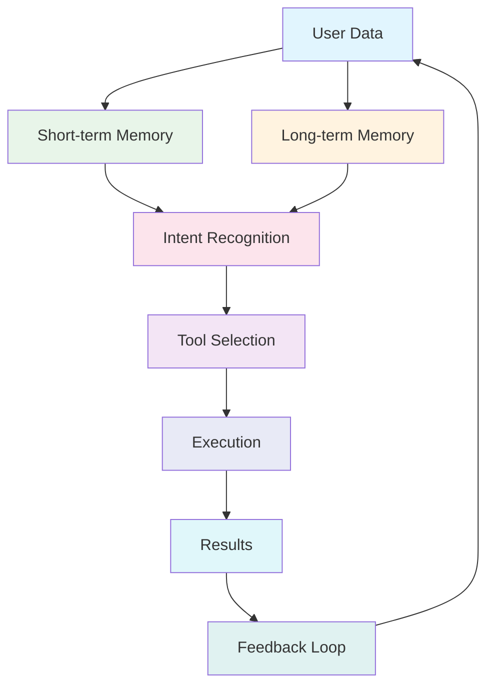

# Promptmack Project Roadmap

This document outlines the development roadmap for Promptmack, highlighting key milestones, planned features, and future directions.

## Vision

Promptmack aims to be the universal interface between human intent and artificial intelligence. We're building a platform that orchestrates AI tools based on user needs, creating a seamless and intuitive experience for solving complex problems.

## Current Status (Q2 2024)

Promptmack currently offers:

- A streaming AI interface powered by Google Gemini models
- Tool integration for news, scholarly articles, videos, similar websites, and form submission
- Multimodal input with file attachments
- Basic chat history and session management
- Authentication through NextAuth.js
- Responsive design with light/dark mode support

## Short-Term Goals (Q3 2024)

Our immediate focus is on stability, performance, and expanding our tool ecosystem:

### 1. Core Platform Enhancements

- [ ] **Performance Optimization**
  - Reduce initial load time by 30%
  - Implement more efficient streaming
  - Add result caching for common queries

- [ ] **UI/UX Improvements**
  - Enhance mobile responsiveness
  - Add keyboard shortcuts
  - Implement progressive loading for large result sets
  - Add inline tool suggestions based on user queries

- [ ] **Error Handling**
  - Create more robust error states
  - Implement automatic retry logic
  - Add better error reporting for debugging

### 2. New Tools & Integrations

- [ ] **Shopping Search Tool**
  - Compare prices across retailers
  - Filter by price, rating, availability
  - Save products to favorites

- [ ] **Translation Tool**
  - Support for 50+ languages
  - Document translation
  - Real-time conversation translation

- [ ] **Calendar Integration**
  - Schedule events directly from chat
  - Set reminders
  - View upcoming appointments

- [ ] **Document Analysis**
  - Extract insights from PDFs, Word documents
  - Summarize long documents
  - Question answering based on document content

### 3. Authentication & Personalization

- [ ] **Enhanced Authentication**
  - Add OAuth providers (Google, GitHub)
  - Implement role-based access
  - Add team accounts

- [ ] **User Preferences**
  - Customizable UI
  - Tool prioritization
  - Default search parameters

## Mid-Term Goals (Q4 2024 - Q1 2025)

Our mid-term focus is on expanding capabilities and user personalization:

### 1. Advanced Intelligence

- [ ] **Context Awareness**
  - Long-term memory across sessions
  - User preference learning
  - Proactive suggestions based on usage patterns

- [ ] **Multi-step Reasoning**
  - Implement chain-of-thought planning
  - Add step-by-step problem decomposition
  - Create more complex workflows with multiple tools

- [ ] **Enhanced Understanding**
  - Better intent recognition
  - Contextual parameter extraction
  - Improved error recovery

### 2. Developer Platform

- [ ] **Tool Creation API**
  - Allow developers to create custom tools
  - Implement tool validation and testing framework
  - Add tool analytics dashboard

- [ ] **Webhook Integration**
  - Enable third-party service integration
  - Create event subscription system
  - Add custom action triggers

- [ ] **Developer Portal**
  - Create documentation site
  - Add interactive tool builder
  - Implement testing playground

### 3. Integration & Expansion

- [ ] **Mobile Apps**
  - Native iOS application
  - Native Android application
  - Offline capabilities

- [ ] **API Ecosystem**
  - Public API for Promptmack integration
  - SDK for popular programming languages
  - Embedding capabilities for third-party sites

- [ ] **Enterprise Features**
  - SSO integration
  - Compliance controls
  - Usage analytics
  - Custom deployment options

## Long-Term Vision (Q2 2025 and Beyond)

Our long-term vision focuses on autonomous capabilities and deeper intelligence:

### 1. Autonomous Agents

- [ ] **Persistent Agents**
  - Agents that run in the background
  - Proactive task execution
  - Ongoing monitoring and alerts

- [ ] **Multi-Agent Collaboration**
  - Specialized agents for different domains
  - Agent-to-agent communication
  - Collaborative problem solving

- [ ] **AGI Integration**
  - Readiness for more advanced AI models
  - Novel tool creation by AI
  - Self-improvement capabilities

### 2. Expanded Modalities

- [ ] **Voice Interface**
  - Natural conversation with AI
  - Voice authentication
  - Multi-language voice support

- [ ] **Visual Understanding**
  - Camera-based visual analysis
  - Real-time object recognition
  - Visual task execution

- [ ] **Ambient Intelligence**
  - Context-aware suggestions
  - Environmental awareness
  - Predictive assistance

### 3. Ecosystem Growth

- [ ] **Tool Marketplace**
  - Monetization options for developers
  - Premium tool subscriptions
  - Usage-based pricing

- [ ] **Domain-Specific Versions**
  - Specialized for healthcare, legal, education
  - Industry-specific tools and knowledge
  - Compliance with domain regulations

- [ ] **Open Source Foundation**
  - Core platform as open source
  - Community governance model
  - Plugin ecosystem

## Technical Evolution

Our technical architecture will evolve alongside our features:

### Data Architecture



### Database Evolution

```sql
-- Current Schema
CREATE TABLE users (
  id UUID PRIMARY KEY,
  email VARCHAR(64) UNIQUE,
  password VARCHAR(64),
  created_at TIMESTAMP
);

CREATE TABLE threads (
  id UUID PRIMARY KEY,
  user_id UUID REFERENCES users(id),
  messages JSONB,
  created_at TIMESTAMP,
  updated_at TIMESTAMP
);

-- Future Schema (Q4 2024)
CREATE TABLE agents (
  id UUID PRIMARY KEY,
  user_id UUID REFERENCES users(id),
  capabilities JSONB,
  memory JSONB,
  preferences JSONB,
  created_at TIMESTAMP
);

CREATE TABLE tools (
  id UUID PRIMARY KEY,
  creator_id UUID REFERENCES users(id),
  name VARCHAR(64),
  description TEXT,
  parameters JSONB,
  execution_code TEXT,
  public BOOLEAN,
  created_at TIMESTAMP,
  updated_at TIMESTAMP
);

CREATE TABLE executions (
  id UUID PRIMARY KEY,
  thread_id UUID REFERENCES threads(id),
  tool_id UUID REFERENCES tools(id),
  parameters JSONB,
  result JSONB,
  performance_metrics JSONB,
  created_at TIMESTAMP
);
```

## Contribution & Development

We welcome contributions in the following areas:

1. **Tool Development**: Create new tools that expand Promptmack's capabilities
2. **UI Components**: Improve existing components or add new ones
3. **Performance Optimization**: Enhance speed and efficiency
4. **Documentation**: Improve guides, tutorials, and examples
5. **Testing**: Add test coverage and find/fix bugs

Please see our [Development Workflow](./development_workflow.md) document for guidelines on contributing to Promptmack.

## Feedback & Research

Our roadmap is influenced by:

1. **User Feedback**: Direct input from users
2. **Usage Analytics**: Understanding how people use Promptmack
3. **Technical Advancements**: New capabilities in AI models and APIs
4. **Market Trends**: Evolving needs and expectations

We actively welcome feedback and suggestions for our roadmap. Please open issues on our GitHub repository or contact the team directly.

## Release Schedule

| Release | Target Date | Key Features |
|---------|-------------|--------------|
| v0.2.0  | July 2024   | Shopping tool, Translation tool, UI improvements |
| v0.3.0  | September 2024 | Document analysis, Calendar integration, OAuth providers |
| v0.4.0  | November 2024 | Developer API, Advanced context awareness |
| v0.5.0  | January 2025 | Mobile apps (beta), Webhook integration |
| v1.0.0  | March 2025   | Stable API, Enterprise features, Full mobile support |

This roadmap is subject to change based on user feedback, technical challenges, and strategic priorities. We'll update this document as our plans evolve. 