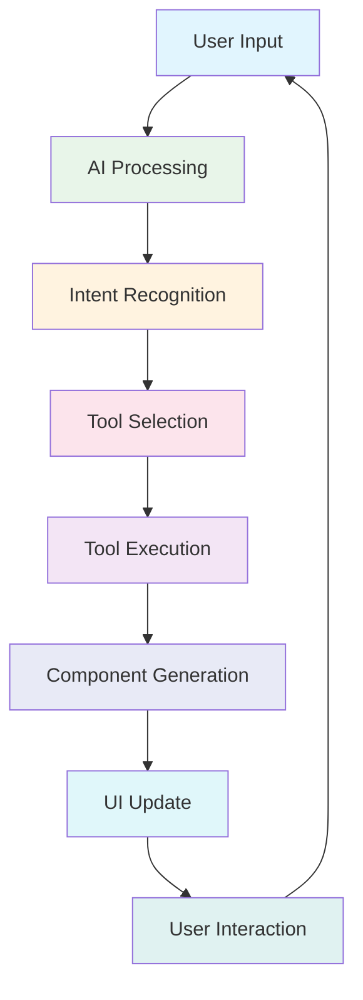

# Promptmack: A Comprehensive Architecture Overview

## Introduction

Promptmack is an adaptive AI agent platform designed to perform tasks and actions online for users. It leverages the power of large language models (LLMs) combined with a dynamic component-based UI to provide an intuitive and powerful interface for human-AI collaboration.

## Core Concepts

### 1. Streaming Intelligence
- Real-time streaming of AI responses via Vercel AI SDK
- Dynamic UI component generation based on AI outputs
- Progressive rendering of information as it's generated

### 2. Tool Orchestration
- AI model can invoke specialized tools based on user intent
- Tools can call APIs, query databases, execute functions, and render components
- Each tool has input parameters, execution logic, and UI rendering

### 3. Component-Based UI
- Messages can contain both text content and rich, interactive components
- Components materialize in real-time as tool results become available
- Users can interact with components to refine or advance their goals

## Architecture Diagram



## Technical Stack

### Frontend
- **Framework**: Next.js 14 (App Router)
- **UI**: Tailwind CSS, shadcn/ui, Framer Motion
- **State Management**: React Hooks, Vercel AI SDK
- **Streaming**: Token-level updates, Component generation

### Backend
- **Infrastructure**: Vercel Edge Runtime, Serverless Functions
- **Database**: PostgreSQL (via Vercel Postgres), Drizzle ORM
- **Storage**: Vercel Blob for file attachments
- **Authentication**: NextAuth.js

### AI Integration
- **Models**: Google Gemini (default), OpenAI, Anthropic, etc.
- **SDK**: Vercel AI SDK for streaming and function calling
- **Tools**: External API integrations, database operations, UI components

## Database Schema

```sql
-- Users table
CREATE TABLE users (
  id UUID PRIMARY KEY,
  email VARCHAR(64) UNIQUE,
  password VARCHAR(64),
  created_at TIMESTAMP
);

-- Threads (conversations) table
CREATE TABLE threads (
  id UUID PRIMARY KEY,
  user_id UUID REFERENCES users(id),
  messages JSONB,
  created_at TIMESTAMP,
  updated_at TIMESTAMP
);

-- Reservations table (for flight bookings)
CREATE TABLE reservations (
  id UUID PRIMARY KEY,
  user_id UUID REFERENCES users(id),
  details JSONB,
  payment_status BOOLEAN,
  created_at TIMESTAMP
);
```

## Integration Patterns

### 1. Adding a New Tool

The core integration pattern for adding new functionality to Promptmack is through tools. Here's how to add a new tool:

#### Step 1: Define the Tool in `app/(chat)/api/chat/route.ts`

```typescript
// Add to the tools object
tools: {
  // ... existing tools
  
  yourTool: {
    description: "What your tool does",
    parameters: z.object({
      param1: z.string().describe("Description of parameter 1"),
      param2: z.number().describe("Description of parameter 2"),
    }),
    execute: async ({ param1, param2 }) => {
      try {
        const response = await fetch("https://your-api-endpoint.com", {
          method: "POST",
          headers: {
            "Content-Type": "application/json",
            "Authorization": `Bearer ${process.env.YOUR_API_KEY}`
          },
          body: JSON.stringify({ param1, param2 })
        });
        
        return response.json();
      } catch (error) {
        console.error("Your Tool API error:", error);
        throw error;
      }
    }
  }
}

// Update the system prompt to inform the AI about the new tool
system: `\n
  - you are Promptmack
  - you are a hyperintelligent helpful assistant
  - you help users and you currently have these tools at your disposal: news, scholar, similar, form-submit, videos, and yourTool!
  - yourTool can be used to [description of capability]
  - today's date is ${new Date().toLocaleDateString()}.
  - go with the flow
  - ask for any details you don't know'
`
```

#### Step 2: Create a Component in `components/[category]/your-tool.tsx`

```typescript
"use client";

import { motion } from "framer-motion";
import React from "react";

interface YourToolData {
  // Define the shape of your tool's result data
  title: string;
  results: Array<{
    id: string;
    name: string;
    value: string;
  }>;
}

interface YourToolProps {
  yourToolData?: YourToolData;
}

export const YourTool = ({ yourToolData }: YourToolProps) => {
  // Loading state (when tool is executing)
  if (!yourToolData) {
    return (
      <div className="animate-pulse space-y-3">
        <div className="h-4 bg-zinc-200 dark:bg-zinc-800 rounded w-3/4" />
        <div className="h-3 bg-zinc-200 dark:bg-zinc-800 rounded w-1/2" />
        <div className="h-2 bg-zinc-200 dark:bg-zinc-800 rounded w-1/4" />
      </div>
    );
  }

  // Error state
  if ('error' in yourToolData) {
    return (
      <div className="text-red-500 p-2 rounded-lg bg-red-50 dark:bg-red-900/20">
        Error: {(yourToolData as any).error}
      </div>
    );
  }

  // Success state
  return (
    <div className="space-y-4">
      <h3 className="text-lg font-medium">{yourToolData.title}</h3>
      <div className="grid grid-cols-1 gap-3">
        {yourToolData.results.map((item, index) => (
          <motion.div
            key={item.id}
            initial={{ opacity: 0, y: 5 }}
            animate={{ opacity: 1, y: 0 }}
            transition={{ delay: index * 0.1 }}
            className="p-3 rounded-lg bg-zinc-100/80 dark:bg-zinc-800/30"
          >
            <p className="font-medium">{item.name}</p>
            <p className="text-sm text-zinc-600 dark:text-zinc-400">
              {item.value}
            </p>
          </motion.div>
        ))}
      </div>
    </div>
  );
};
```

#### Step 3: Update the Message Component in `components/custom/message.tsx`

```typescript
// Import your component
import { YourTool } from "../[category]/your-tool";

// Inside the Message component, add to the toolInvocations mapping
{toolName === "yourTool" ? (
  <YourTool yourToolData={result} />
) : toolName === "anotherTool" ? (
  // Other tool mappings...
) : null}

// Also add to the loading state section
{toolName === "yourTool" ? (
  <YourTool />
) : toolName === "anotherTool" ? (
  // Other tool loading states...
) : null}
```

#### Step 4: Add a Trigger Action in `components/custom/multimodal-input.tsx` (Optional)

```typescript
// Add to suggestedActions array
const suggestedActions = [
  // Existing actions...
  {
    title: "YourTool",
    label: "Description",
    action: "Use YourTool to do something",
    icon: <YourIcon size={14} />
  }
];
```

### 2. Adding Environment Variables

Add any required API keys or configuration to `.env.example`:

```
YOUR_API_KEY=your_api_key_here
```

### 3. Database Operations (if needed)

If your tool requires database operations:

1. Define schema in `db/schema.ts`:
```typescript
export const yourTable = pgTable("your_table", {
  id: serial("id").primaryKey(),
  userId: text("user_id").notNull().references(() => users.id),
  data: json("data").notNull(),
  createdAt: timestamp("created_at").defaultNow(),
});
```

2. Add migrations in `db/migrate.ts`:
```typescript
await db.execute(sql`
  CREATE TABLE IF NOT EXISTS your_table (
    id SERIAL PRIMARY KEY,
    user_id TEXT NOT NULL REFERENCES users(id),
    data JSONB NOT NULL,
    created_at TIMESTAMP DEFAULT NOW()
  );
`);
```

3. Create queries in `db/queries.ts`:
```typescript
export const createYourRecord = async ({
  id,
  userId,
  data,
}: {
  id: string;
  userId: string;
  data: any;
}) => {
  return db.insert(yourTable).values({
    id,
    userId,
    data,
  });
};

export const getYourRecordById = async ({ id }: { id: string }) => {
  const records = await db
    .select()
    .from(yourTable)
    .where(eq(yourTable.id, id))
    .limit(1);

  return records[0];
};
```

## Development Best Practices

1. **Error Handling**
   - Always handle API failures gracefully
   - Provide meaningful error states in components
   - Log errors for debugging

2. **Performance**
   - Keep component rendering efficient
   - Use appropriate loading states
   - Implement pagination for large result sets

3. **Security**
   - Never expose API keys in client code
   - Validate all inputs
   - Use proper authentication for protected resources

4. **UI/UX**
   - Follow existing component patterns
   - Provide meaningful loading states
   - Ensure responsive design

## Testing

1. Start development server:
```bash
pnpm dev
```

2. Test with example prompts:
```
- "Use [your feature] to [action]"
- "Show me [feature result]"
- "Help me with [feature task]"
```

## Troubleshooting

1. **Component not rendering?**
   - Check tool name matches in route.ts and message.tsx
   - Verify loading state implementation

2. **API not responding?**
   - Verify API key in .env
   - Check network tab for errors
   - Validate API endpoint URL

3. **Database issues?**
   - Run migrations: `pnpm build`
   - Check database connection
   - Verify schema matches

## Future Roadmap

Promptmack is evolving towards:

1. **Enhanced Intelligence**
   - Predictive tool activation
   - Advanced pattern recognition
   - Learning from user interactions

2. **Tool Ecosystem Expansion**
   - Developer platform
   - Tool marketplace
   - Custom tool creation

3. **Interface Evolution**
   - Multi-modal input
   - Advanced visualization
   - Ambient intelligence

## Contributing

To contribute to Promptmack:

1. Follow the code style and patterns in existing files
2. Create a new branch for your feature
3. Add tests for your changes
4. Submit a pull request with a clear description of your changes

## Need Help?

- Check existing implementations in `/components`
- Review similar patterns in `route.ts`
- Examine `message.tsx` for integration examples 