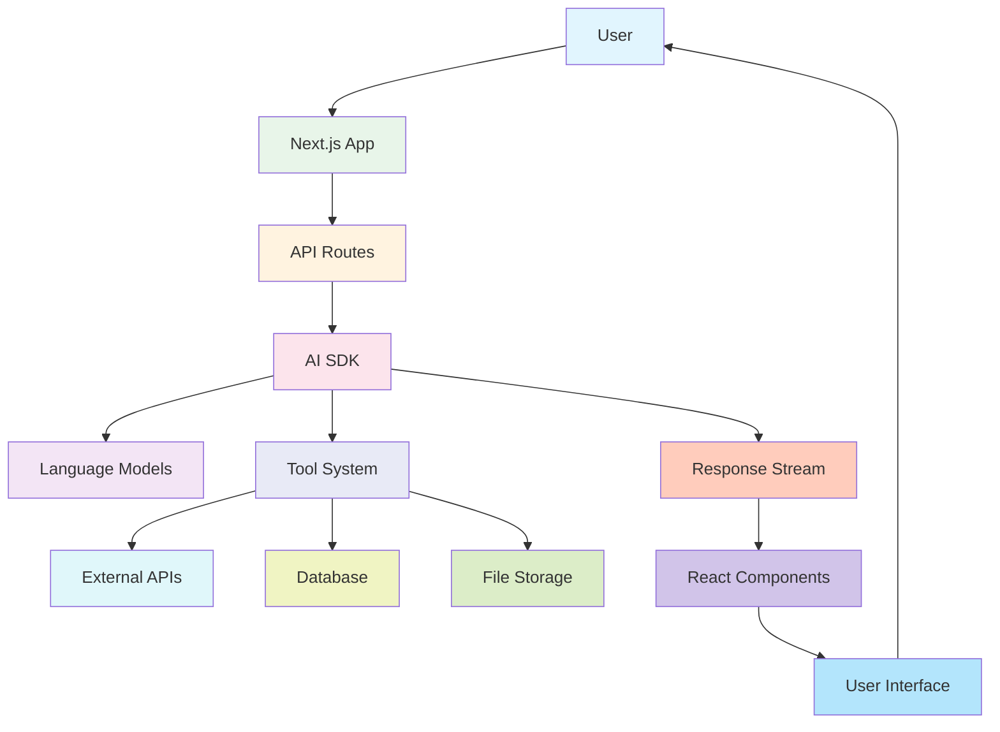

# Promptmack Technical Introduction

This document provides a technical overview of Promptmack's architecture, codebase structure, and core technical concepts.

## Technical Architecture

Promptmack is built on a modern React and Next.js stack with a focus on streaming responses and generative UI. Here's a high-level overview of the system architecture:



### Key Components

1. **Next.js Application**
   - App Router for server components and API routes
   - Built-in authentication with NextAuth.js
   - Edge runtime for optimal performance

2. **AI SDK Integration**
   - Uses Vercel AI SDK for streaming responses
   - Supports multiple model providers (Google Gemini by default)
   - Implements tool calling for external integrations

3. **Tool System**
   - Function-calling interface for the AI model
   - Parametric execution of external API calls
   - Result streaming and transformation

4. **Database Layer**
   - PostgreSQL via Vercel Postgres
   - Drizzle ORM for type-safe queries
   - JSON storage for chat messages

5. **UI Components**
   - React components with Tailwind CSS
   - Streaming UI rendering
   - Progressive loading states

## Codebase Structure

```
promptmack/
├── app/                      # Next.js App Router
│   ├── (auth)/               # Authentication routes
│   ├── (chat)/               # Chat interface and API routes
│   │   ├── api/
│   │   │   ├── chat/
│   │   │   │   └── route.ts  # Main AI/chat endpoint
│   │   │   └── files/        # File upload endpoints
│   │   └── page.tsx          # Main chat interface
│   ├── api/                  # Global API routes
│   ├── layout.tsx            # Root layout
│   └── globals.css           # Global styles
├── components/               # React components
│   ├── custom/               # App-specific components
│   │   ├── message.tsx       # Message rendering
│   │   ├── chat.tsx          # Chat container
│   │   └── multimodal-input.tsx # User input interface
│   ├── ui/                   # shadcn/ui components
│   ├── paid/                 # Premium tool components
│   ├── weather/              # Weather components
│   └── flights/              # Flight-related components
├── db/                       # Database integration
│   ├── index.ts              # Database connection
│   ├── schema.ts             # Drizzle schema
│   ├── migrate.ts            # Migration system
│   └── queries.ts            # Database queries
├── lib/                      # Shared utilities
│   ├── utils.ts              # Helper functions
│   ├── drizzle.ts            # Drizzle ORM setup
│   └── auth.ts               # Authentication helpers
├── ai/                       # AI integration
│   ├── index.ts              # AI client setup
│   └── actions.ts            # AI helper functions
├── public/                   # Static assets
└── styles/                   # Additional styles
```

## Data Flow

The typical data flow in Promptmack follows this sequence:

1. **User Input**
   - User submits a message through the multimodal input
   - UI adds the message to the local state
   - Message is sent to the API route

2. **API Processing**
   - API route authenticates the request
   - Message is passed to the AI model via AI SDK
   - System prompt instructs the model on available tools

3. **AI Processing**
   - AI model generates a response, potentially invoking tools
   - Tool calls are executed server-side
   - Results are streamed back to the client

4. **UI Updates**
   - Client receives streamed response tokens
   - Tool results trigger component rendering
   - UI updates in real-time as data arrives

5. **Storage**
   - Completed conversation is stored in the database
   - Files are stored in Vercel Blob storage
   - User preferences are updated if needed

## Key Technical Concepts

### 1. Streaming Architecture

Promptmack uses a streaming architecture to provide real-time updates to the user interface. This is implemented using:

- Server-Sent Events (SSE) for data streaming
- Vercel AI SDK for model integration and streaming
- React state management for progressive UI updates

```typescript
// Streaming text generation in route.ts
const result = await streamText({
  model: geminiProModel,
  system: systemPrompt,
  messages: coreMessages,
  tools: {
    // Tool definitions
  },
});

return result.toDataStreamResponse({});
```

### 2. Tool System

The tool system allows the AI to interact with external services and render specialized UI components:

```typescript
// Tool definition example
getNews: {
  description: "Get news articles based on a search query",
  parameters: z.object({
    query: z.string().describe("Search query for news"),
  }),
  execute: async ({ query }) => {
    // API call implementation
    return responseData;
  },
}
```

Each tool includes:
- Description for the AI model
- Parameter schema using Zod
- Execution logic
- Corresponding UI component

### 3. Component Rendering

Tools are rendered through a component system that handles different states:

```typescript
// In message.tsx
{toolName === "getNews" ? (
  <News newsData={result} />
) : toolName === "getWeather" ? (
  <Weather weatherAtLocation={result} />
) : null}
```

Components implement standard patterns:
- Loading state (skeleton)
- Error state
- Success state with data rendering

### 4. Database Schema

The database schema is designed for flexibility and performance:

```typescript
// Sample schema from db/schema.ts
export const users = pgTable("users", {
  id: text("id").primaryKey(),
  email: text("email").unique().notNull(),
  password: text("password"),
  createdAt: timestamp("created_at").defaultNow(),
});

export const threads = pgTable("threads", {
  id: text("id").primaryKey(),
  userId: text("user_id").notNull().references(() => users.id),
  messages: json("messages").notNull(),
  createdAt: timestamp("created_at").defaultNow(),
  updatedAt: timestamp("updated_at").defaultNow(),
});
```

### 5. Authentication System

Authentication is handled by NextAuth.js with a custom configuration:

```typescript
// Simplified auth configuration
export const { auth, signIn, signOut } = NextAuth({
  providers: [
    Credentials({
      // Credentials provider configuration
    }),
  ],
  callbacks: {
    // Custom callbacks for authorization and session handling
  },
  session: { strategy: "jwt" },
});
```

## Performance Considerations

### Server-Side Rendering

- Next.js App Router for server components
- Edge runtime for reduced latency
- Streaming responses for faster time-to-first-byte

### Client-Side Optimization

- Progressive loading states
- Optimistic UI updates
- Efficient component re-rendering

### Database Optimization

- Efficient JSON storage for messages
- Indexing for common queries
- Connection pooling

## Security Considerations

### Authentication

- JWT-based sessions
- Password hashing with bcrypt
- CSRF protection

### API Security

- Server-side API key storage
- Input validation with Zod
- Rate limiting for API endpoints

### Data Protection

- Data minimization principles
- User data isolation
- Secure environment variable handling

## Extension Points

Promptmack is designed to be easily extended:

1. **New Tools**
   - Add tool definitions in `route.ts`
   - Create corresponding UI components
   - Update the system prompt

2. **Model Providers**
   - Support for multiple AI models
   - Configurable parameters
   - Provider-specific optimizations

3. **UI Components**
   - Consistent loading/error states
   - Responsive design patterns
   - Animation guidelines

## Technical Debt and Limitations

Current technical limitations include:

1. **Memory Constraints**
   - Limited context window for AI models
   - Memory management for large conversations

2. **Scalability Considerations**
   - Tool execution timeout handling
   - Database scaling for high user load
   - File storage limitations

3. **Integration Challenges**
   - API rate limits for external services
   - Error handling for unreliable services
   - Authentication for third-party APIs

## Development Environment

### Local Setup

```bash
# Clone the repository
git clone https://github.com/your-organization/promptmack.git

# Install dependencies
pnpm install

# Set up environment variables
cp .env.example .env

# Start development server
pnpm dev
```

### Environment Variables

Key environment variables include:

```
# Authentication
AUTH_SECRET=your_secret_here

# Database
POSTGRES_URL=your_postgres_connection_string

# AI
GOOGLE_GENERATIVE_AI_API_KEY=your_api_key

# External APIs
SERPER_API_KEY=your_serper_api_key
EXA_API_KEY=your_exa_api_key
SKYVERN_API_KEY=your_skyvern_api_key
```

### Testing Approaches

1. **Component Testing**
   - Test UI components in isolation
   - Mock tool responses
   - Test loading/error states

2. **Integration Testing**
   - Test complete user flows
   - Mock external APIs
   - Verify database interactions

3. **End-to-End Testing**
   - Test complete application
   - Simulate user interactions
   - Verify responses and UI updates

## Conclusion

Promptmack's architecture combines modern web technologies with AI capabilities to create a powerful and extensible platform. By understanding these core technical concepts, developers can effectively contribute to the project and extend its capabilities.

For more detailed documentation, refer to:
- [Development Workflow](./development_workflow.md)
- [Tools Documentation](./tools.md)
- [Project Roadmap](./project_roadmap.md) 